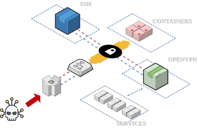

# Redteam Operation Infrastucture as a Code

**No me responsabilizo por el mal uso que se le valla a dar al codigo expuesto en este repositorio, el codigo a sido expuesto para fines educativos y para ser usado en ambientes controlados previo acuerdo con todas las partes.**

## Descripción

Este proyecto busca automatizar gran parte de las tareas repetitivas en el proceso de pentest y/o redteam, desde levantar una infraestructura que permitira manipular redes internas e internas. Principalmente saltar protecciones actuales de firewalls y equipos de seguridad.

Componentes:

* El acceso es por medio de sslh (multiplexador ssh + ssl), exponiendo el puerto 443 (ssl) sera redirigido internamente a ssh, ssl o vpn utilizando expresiones regulares. [Mas información sobre sslh](https://github.com/yrutschle/sslh)
* Exposición del puerto 8443 para ssh.
* Contenedor spiderfoot, permite realizar enumeración de diferentes servicios. Este contenedor por defecto queda funcionando en localhost puerto 5001, para acceder a el lo puedes hacer con ssh =) [Mas información](https://github.com/smicallef/spiderfoot)
* Contenedor koadic, C3 COM Command & Control. [Mas información](https://github.com/zerosum0x0/koadic)
* Openvpn, estamos trabajando para usted...

Diagrama general de la infraestructura



## Prerequisitos

* Dominio (example.org)
* Cuenta Linode
* Ansible 2.9.x (Para mitogen, no soporta versiones superiores)
* Recomendado usar virtualenv
* Terraform >= 13

## Instalación

```bash
git clone --recurse-submodules https://github.com/vickimgore/Redteam-Operation_IaC
cd Redteam-Operation_IaC
```

## Configuración

### Configurar el entorno virtual

```bash
virtualenv --python=3.8.6 .
source bin/activate
pip install -r requirements.txt
```

### Iniciar submodulo mitogen

```bash
git submodule init
git submodule update
```

### Copiar el ejemplo terraform.tfvar

```bash
cp terraform.tfvar.example terraform.tfvar
```

### Editar terraform.tfvar

```bash
#For Instance
image = "linode/centos7"
label = "0x7e4"
region = "us-east"
type = "g6-nanode-1"
#sudo user
username = "someuser"
#Ansible Variables
ANSIBLE_DEBUG = "0"
#Remote Variables
hostname = "0x7e4"
DOMAIN = "example.org"
#remote working directory
WORKDIR = "/opt/docker"
```

### Copiar el ejemplo de secrets.tfvar

```bash
cp secrets.tfvar.example secrets.tfvar
```

### Editar secrets.tfvar

```bash
linode_token = ""
```

### Inicio terraform

```bash
terraform init
```

### Validacion

```bash
terraform plan -var-file=terraform.tfvar -var-file=secrets.tfvar
```

### Ejecucion

```bash
terraform apply -var-file=terraform.tfvar -var-file=secrets.tfvar
```

### Destruccion

```bash
terraform destroy -var-file=terraform.tfvar -var-file=secrets.tfvar
```

## Charlas

- [Pwning networks on 10 min or less - Hackeemting Yacuiba 2020 - ES](https://youtu.be/lqSWOakmnqA?t=5384)
- [Presentación](https://docs.google.com/presentation/d/1LWUz2h1QDtIptn0WYXXGIxwJWPEEDZjh4UwF-D7r_7o/edit#slide=id.g1f87997393_0_782)

## TODO

- [x] Despliegue automatico de infrastructura
- [x] Despliegue de imagenes y docker-compose automatico
- [x] Correcion problemas detectados en sslh
- [x] Correcion de logica y orden de servicios
- [x] Mejorar tiempos de despliegue
- [ ] Incorporar role para openvpn
- [ ] Agregar reglas custom post despliegue
- [ ] Crear wiki de proyecto
- [ ] Crear imagen docker para este proyecto con respectivo docker-compose.

## Futuro

- [ ] Agregar control desde discord
- [ ] Incorporar otros C&C
- [ ] Incorporar comunicacion SSL para C&C